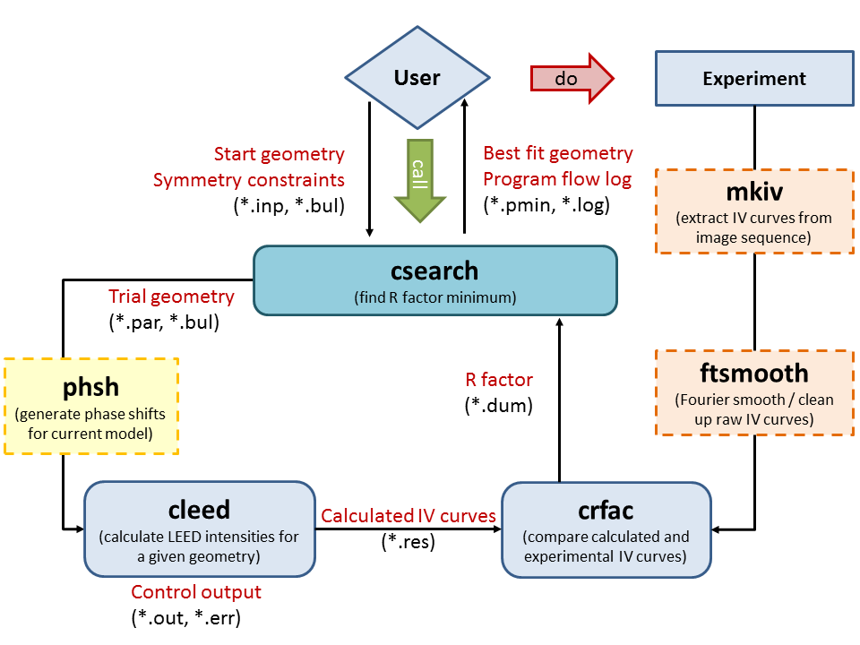

.. _LEED_programs:

*************
LEED programs
*************

The CLEED package contains many command line programs that interact 
with one another to simulate and compare the LEED-IV curves with 
experimental data. The master program is :ref:`csearch`, however a lot of
information is exchanged under the hood during any given structural search 
determination. The process is rather complex, but can hopefully be summarised 
in the figure below:

    
    Figure 1. Program work flow for the CLEED package.
    
It is sometimes useful to manually run the individual programs and therefore 
what follows are notes to aid in the use of the CLEED programs.
    
.. include:: ./LEED_programs/cleed.rst

.. include:: ./LEED_programs/crfac.rst
  
.. include:: ./LEED_programs/csearch.rst

.. include:: ./LEED_programs/set_env.rst